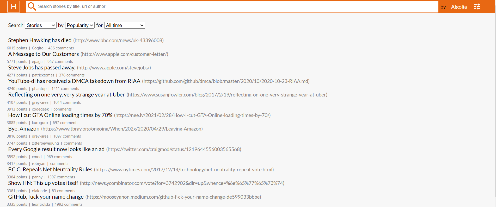

# Hacker News Search Filter:
### It is a React web application which gives out the results matching with the input string fed by the user. Internally it uses Algolia API for the required output data.

- The Output can be filtered on the basis of the of Jobs, stories, comments,etc.
- The Tech Stack used is ReactJS, CSS.
- The Application has achieved the behaviour of a fuzzy search(Real time results).
- Material UI is used for Icons, Google fonts is used for external fonts.
- The detailed insight of the story can we got by visiting the URL placed after the title.
- Ratings, Author and comment details are also provided below the story title.
- The app is responsive in different viewports.
- Scope of UI and functional improvements are there.

### Visit the app here: <a href="https://hackernewssearch.vercel.app/">Link 
